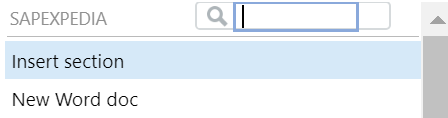
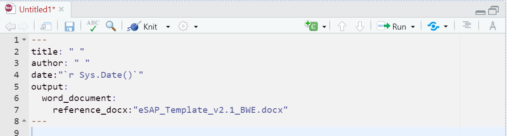
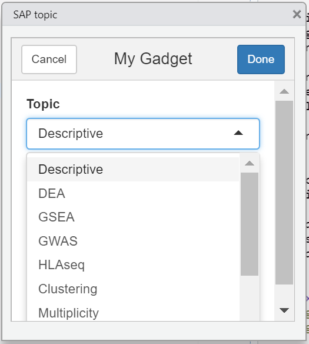

# SAPexpedia

This Rstudio/R Addin aims to facilicate the processing of writing statistical analysis plan (SAP) using `Rmd`. Currently it's in the development phase. Users can insert the description of a specific omic or statistical method with pre-defined content.

The planed upgrades are:

-   tailor to a specific biomarker(s)
-   tailor to a specific compound name.
-   integrated reference with Endnote citation format.

## Installation

Install directly from Github:

    devtools::install_github("outboundbird/SAPexpedia")

## Usage

1.  create a Rmarkdown file with `New Word doc`function, which will generate MS word document with internal Word template.
2.  The user will be directed to newly generated rmd file:

3\. Insert the topic of interest onto the Rmd file. The descriptions can be inserted to any types of files but it is optimized for the markdown output.

## Issues and suggestions

Please use the git issues to submit bugs and suggestions.
